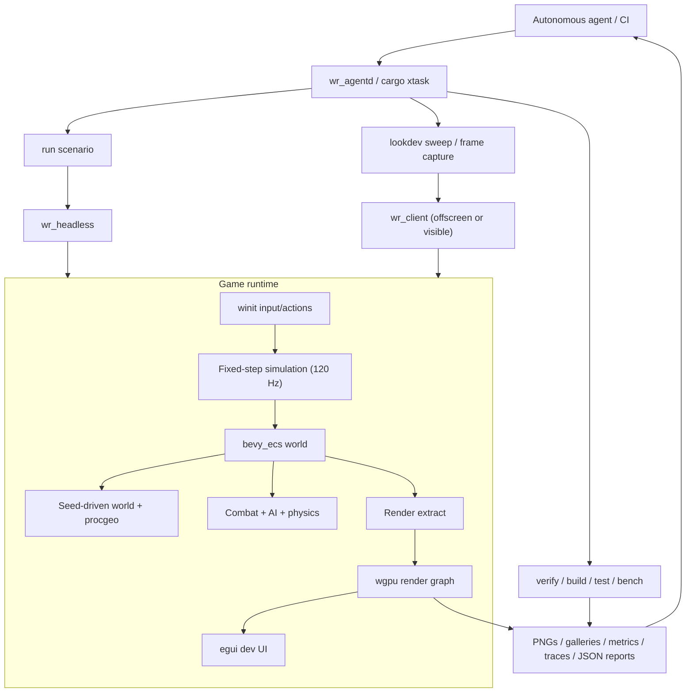
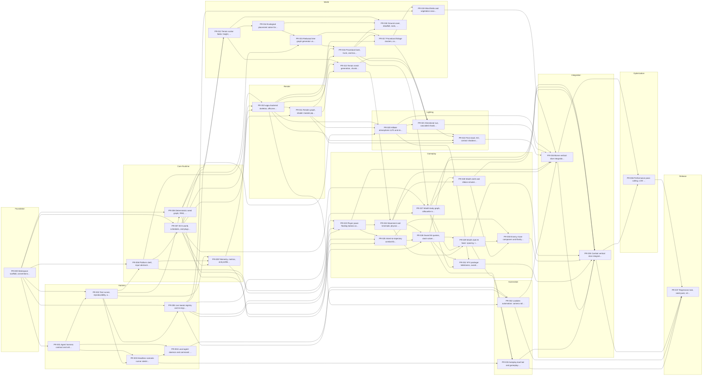

# Wrela v0 Rust Project Plan

This plan is for a **vertical slice game runtime**, not a generalized engine. The right move is to ship a narrow, astonishing slice first, with the architecture clean enough that future generalization is possible.

The v0 deliverable is a playable seed-driven redwood forest duel slice:
a generated hero biome, a Hillaire-inspired sky and lighting stack, a first-person floating telekinetic katana, one wraith archetype with cloth/ribbons, intent-driven procedural combat, and a harness that lets autonomous agents build, test, lookdev, replay, and validate the game without a human driving the mouse.

## Working assumptions I am freezing into the plan

These are the decisions I am making so the roadmap is sharp instead of mushy:

- **Product shape:** bespoke game runtime first, with clean enough subsystem boundaries to generalize later.
- **Target slice:** one non-streaming, seed-driven **512m x 512m** hero biome cell.
- **Visual target:** stylized AAA outdoor scene quality, closer to “hero art direction” than full photoreal outdoor simulation.
- **Platform target:** Mac M4 dev machine first; architecture stays portable to Windows/Linux.
- **Performance target:** 1080p60 on the Mac M4 dev machine for canonical traversal and duel scenarios.
- **Time-of-day:** one fixed late-afternoon hero setup in v0.
- **Player embodiment:** sword-as-character only; no visible body in v0.
- **Combat shape:** 1v1 duels only in v0.
- **World simulation:** static after generation in v0; no ongoing ecological sim.
- **Asset policy:** no imported meshes or animation clips; procedural geometry/materials/VFX only. Small LUTs, noise tables, parameter packs, and generated caches are allowed.
- **Forest philosophy:** systemic placement and growth rules, but not a forever-simulating ecosystem.
- **Autonomous development constraint:** all workflows the agent needs must be scriptable, deterministic, and artifact-first.

## End-state v0 acceptance criteria

- Launch the client on the Mac dev machine and generate the same hero forest from the same seed every time.
- Render a stylized late-afternoon redwood biome with Hillaire atmosphere, strong directional lighting, stable shadows, aerial perspective, and tuned post-processing.
- Let the player move as a floating telekinetic katana with strafe, jump, dash, light attack, heavy attack, and parry.
- Spawn a silhouette-first wraith with procedural body presentation, telekinetic blade, and ribbon/cloth secondary motion.
- Run a readable 1v1 duel loop using intent-driven mathematical trajectory families instead of imported animation clips.
- Allow the autonomous harness to run headless smoke scenarios, autoplay duel validation, lookdev sweeps, capture galleries, and performance checks.
- Hit the 1080p60 target on the Mac M4 dev machine in the canonical traversal and duel scenarios, or fail with quantified reports and documented cut recommendations.

## Explicit non-goals for v0

- No open-world streaming in v0.
- No day/night cycle in v0.
- No fully simulated ecology over time in v0.
- No destruction, tree cutting, reactive foliage damage, or ground deformation in v0.
- No full volumetric cloud renderer in v0; use a cloud-shadow or atmospheric cheat layer first.
- No full human body, hands, or authored cinematic animations.
- No imported GLB/FBX meshes or animation content.

## System diagram



## Frame pipeline

```mermaid
flowchart LR
  OS["OS events"] --> Input["Action map"]
  Input --> Fixed["Fixed-step sim loop"]
  Fixed --> Move["Movement / physics"]
  Move --> Combat["Combat / AI / cloth / VFX events"]
  Combat --> Extract["Render extraction"]
  Extract --> Shadows["Shadow passes"]
  Shadows --> Atmos["Atmosphere LUTs / sky"]
  Atmos --> Main["Main forward scene pass"]
  Main --> Post["AO / contact shadows / bloom / tonemap"]
  Post --> UI["egui / debug overlays / capture"]
```



## Project structure layout

```text
wrela-v0/
├─ Cargo.toml
├─ rust-toolchain.toml
├─ .cargo/
│  └─ config.toml
├─ xtask/
│  └─ src/
├─ apps/
│  ├─ wr_client/
│  ├─ wr_headless/
│  └─ wr_agentd/
├─ crates/
│  ├─ wr_core/
│  ├─ wr_math/
│  ├─ wr_world_seed/
│  ├─ wr_ecs/
│  ├─ wr_platform/
│  ├─ wr_render_api/
│  ├─ wr_render_wgpu/
│  ├─ wr_render_atmo/
│  ├─ wr_render_scene/
│  ├─ wr_render_post/
│  ├─ wr_world_gen/
│  ├─ wr_procgeo/
│  ├─ wr_physics/
│  ├─ wr_combat/
│  ├─ wr_ai/
│  ├─ wr_actor_player/
│  ├─ wr_actor_wraith/
│  ├─ wr_vfx/
│  ├─ wr_tools_ui/
│  ├─ wr_tools_harness/
│  ├─ wr_telemetry/
│  └─ wr_game/
├─ scenarios/
│  ├─ smoke/
│  ├─ traversal/
│  ├─ duel/
│  └─ lookdev/
├─ tweak_packs/
│  ├─ biome/
│  ├─ atmosphere/
│  ├─ combat/
│  └─ release/
├─ baselines/
│  ├─ captures/
│  ├─ reports/
│  └─ replays/
├─ docs/
│  ├─ adr/
│  ├─ architecture/
│  ├─ perf-budget.md
│  ├─ agent-operating-manual.md
│  └─ release-checklist.md
└─ reports/
   └─ <generated by harness>
```

## Why this architecture

The main design choice is to separate **simulation truth** from **rendering truth**. Gameplay runs in a fixed-step ECS world. Rendering only sees extracted immutable data. That keeps combat deterministic, makes headless testing cheap, and prevents the renderer from contaminating gameplay logic.

The second design choice is to treat the **agent harness as a first-class product**. The autonomous agent should never have to infer success from ad-hoc log text. It should call a command, get a report bundle, and work from structured artifacts.

The third design choice is to avoid pretending this is a full systemic open world. v0 is a static hero cell with strong generation rules, hard scope cuts, and one unforgettable duel loop.

## Architecture notes by subsystem

### Render architecture
Use `wgpu` + WGSL, a light explicit render graph, and a one-way extract step from gameplay ECS to immutable render data. Keep the main renderer forward-oriented because the scene is dominated by one directional light, alpha-tested foliage, and a handful of VFX lights. Use shadow passes + main scene + post instead of overbuilding a deferred renderer.

### World architecture
Treat the forest as a deterministic authored-by-math build product. Generate scalar fields first, then placements, then tree graphs, then meshes/material parameters, then collision. Cache derived data if needed, but make caches disposable and reproducible from seed + tweak pack.

### Combat architecture
Do not chase full rigid-body sword fighting. The correct v0 stack is:
`verb -> move family -> trajectory solver -> selective contact/clash resolution -> recovery/parry state changes -> event-driven VFX`.
That gives you authored-feeling motion without authored animations.

### Wraith architecture
Use silhouette, motion, and cloth to do the heavy lifting. The body should be a procedural graph and shell, not a realistic humanoid. Let emissive accents, fog wisps, and trailing ribbons carry the aesthetic.

### Autonomous harness architecture
The harness is a product. It needs:
1. headless simulation,
2. offscreen capture,
3. machine-readable reports,
4. replay bundles,
5. tweak pack application,
6. canonical cameras,
7. autoplay duel verification,
8. performance reports.

Without those, a “fully autonomous” coding loop turns into an unreliable shell-script pile.

## Agent-facing command surface

```bash
cargo xtask verify
cargo xtask run-scenario scenarios/smoke/startup.ron
cargo xtask run-scenario scenarios/duel/wraith_smoke.ron
cargo xtask lookdev --seed 0xDEADBEEF --pack tweak_packs/release/hero_forest.ron --camera-set forest_hero
cargo xtask capture --scenario scenarios/traversal/hero_path.ron
cargo xtask perf --scenario scenarios/traversal/perf_path.ron
cargo xtask replay baselines/replays/wraith_duel_seed01.json
cargo xtask daemon
```

## Definition of done and quality gates

| Gate | Required for merge |
|---|---|
| Static quality | `cargo fmt --check`, `cargo clippy --workspace --all-targets -- -D warnings` |
| Functional | `cargo nextest run --workspace` via `cargo xtask verify` |
| Determinism | Canonical deterministic tests for changed procedural/combat paths |
| Visual | Offscreen capture smoke tests for rendering-affecting PRs |
| Performance | Benchmarks for hot-path PRs; scenario perf gate for integrated slices |
| Artifacts | JSON report bundle emitted for scenario/capture/perf workflows |

## Roadmap

| Phase | PRs | Exit condition |
|---|---|---|
| Phase 0 — Autonomous foundation | PR-000 to PR-005 | Agent can build, test, run headless scenarios, edit tweak packs, and collect artifacts without ad-hoc shell scraping. |
| Phase 1 — Runtime spine | PR-006 to PR-011 | Windowed client, ECS schedules, telemetry, GPU backend, offscreen capture, and render extraction all work. |
| Phase 2 — Forest generation | PR-012 to PR-019 | Seed-driven hero biome renders with terrain, redwoods, canopy, ground cover, and wind. |
| Phase 3 — Hero lighting | PR-020 to PR-022 | Hillaire sky, shadows, aerial perspective, and post stack are integrated and tweakable. |
| Phase 4 — Duel mechanics | PR-023 to PR-031 | Player sword, wraith presentation, cloth, duel AI, and combat VFX all function in isolation. |
| Phase 5 — Autonomous validation and vertical slices | PR-032 to PR-035 | Agent can do lookdev sweeps and autoplay duel validation in the integrated biome. |
| Phase 6 — Perf + freeze | PR-036 to PR-037 | 1080p60 target is met or quantified, baselines are locked, and the operating manual is complete. |

## Parallel work lanes

- **Lane A — Harness and tooling.** PR-001, PR-002, PR-003, PR-004, PR-005. This lane should start immediately after the scaffold and stays ahead of every other lane.
- **Lane B — Core runtime and render substrate.** PR-006, PR-007, PR-008, PR-009, PR-010, PR-011. This lane unlocks both world and lighting work.
- **Lane C — World generation.** PR-012 through PR-019. Once PR-012, PR-014, and PR-015 are landed, multiple contributors can work on terrain, trunk meshes, foliage, and floor dressing with limited overlap.
- **Lane D — Gameplay and duel systems.** PR-023 through PR-031. This lane should remain crate-local until the combat slice integration PR.
- **Lane E — Automation.** PR-032 and PR-033. These can proceed once headless execution, capture, and combat events exist.
- **Lane F — Integration.** PR-034 and PR-035 are the only PRs that should touch `wr_game` and the app composition crates heavily.

## Merge-conflict and autonomy guardrails

- **Scaffold all crate boundaries first.** Later PRs should almost never need to add a new crate.
- **Integration is delayed on purpose.** `wr_game`, `wr_client`, and `wr_headless` are touched lightly until PR-034 and PR-035.
- **One PR, one subsystem crate.** If a change needs two unrelated crates, split it.
- **Export plugins, do not self-register.** Each subsystem crate exposes a plugin/init function; integration PRs wire them together.
- **Schema-first automation.** Harness requests and reports are versioned contracts, not whatever stdout happened to print that day.
- **No global RNG.** Every deterministic subsystem gets a sub-seed and owns its own RNG stream.

## PR dependency graph

The full machine-readable dependency graph is also in the JSON backlog.



## Discrete PR backlog

Each PR below is intended to be independently mergeable. Until the integration milestones, each PR should stay inside its owning crate(s) and tests.

### PR-000 — Workspace scaffold, conventions, and empty crate topology
**Depends on:** None
**Parallel lane:** Foundation
**Primary crates:** workspace root, xtask, all crate skeletons

**Scope**
Pre-create the full Cargo workspace, empty crate boundaries, CI stubs, lint config, docs/ADR structure, and placeholder plugin interfaces so later PRs mostly stay inside one crate.

**Requirements**
- Create the full workspace and crate layout, including empty public APIs for every planned subsystem.
- Add rust-toolchain, cargo aliases, fmt/clippy policy, feature-flag conventions, and module scaffolding.
- Add docs/adr, docs/architecture, docs/tuning, scenarios/, reports/, generated-cache/ conventions.
- Define the merge policy: subsystem crates only; wr_game and app crates are integration-only.

**Acceptance criteria**
- `cargo check --workspace` passes with all placeholder crates.
- Every future PR in this plan can land by modifying at most one subsystem crate plus tests, until integration milestones.
- ADR-000 documents scope cuts for v0: one biome, one hero time-of-day, one enemy archetype, one weapon, one non-streaming map.

**Tests**
- Workspace compiles on the target Mac dev machine.
- CI smoke job runs fmt, clippy, and cargo check.
- One compile-only test validates that every crate exposes a plugin/init entrypoint.

**Implementation references**
None.

### PR-001 — Agent harness contract and artifact schema
**Depends on:** PR-000
**Parallel lane:** Harness
**Primary crates:** wr_tools_harness, wr_telemetry

**Scope**
Define the machine-readable contract the autonomous agent will use: commands, reports, artifacts, result envelopes, and failure modes.

**Requirements**
- Define JSON schemas for scenario request, capture request, lookdev sweep request, duel report, performance report, and test result bundle.
- Define stable artifact paths and naming conventions so agents can discover outputs without scraping logs.
- Define the error taxonomy: build_failed, test_failed, scenario_failed, perf_regressed, visual_regressed, runtime_crash.

**Acceptance criteria**
- Schemas are versioned and validated during tests.
- A no-op harness command can emit a valid report bundle with metadata, timestamps, git SHA, and seed info.
- At least one end-to-end golden JSON report is checked in as a reference artifact.

**Tests**
- Schema round-trip serialization tests.
- Snapshot tests for canonical report payloads.
- Property tests for backward-compatible report parsing when optional fields are added.

**Implementation references**
None.

### PR-002 — Test runner, reproducibility, and verification stack
**Depends on:** PR-000, PR-001
**Parallel lane:** Harness
**Primary crates:** workspace root, xtask, wr_telemetry

**Scope**
Install the default verification stack for the entire project so every later PR lands with the same tooling.

**Requirements**
- Adopt cargo-nextest as the default workspace test runner.
- Wire proptest for math/procedural property tests, insta for snapshots, criterion for performance benches, and tracing for structured logs.
- Add machine-readable JUnit and JSON export through xtask wrappers.

**Acceptance criteria**
- `cargo xtask verify` runs fmt, clippy, nextest, snapshot checks, and the selected benchmark group.
- A failing property test shrinks and stores the minimized repro input.
- A failing snapshot test prints a human-readable diff and stores the changed artifact for review.

**Tests**
- Self-test xtask command in CI.
- Sample proptest, criterion, and snapshot tests checked into a demo crate.
- Report generation test proves machine-readable outputs land in reports/.

**Implementation references**
- **cargo-nextest** — https://nexte.st/ — Default test runner; process-per-test is useful for GPU and main-thread sensitive tests.
- **Proptest introduction** — https://proptest-rs.github.io/proptest/ — Property-based testing with shrinking.
- **Criterion.rs** — https://docs.rs/criterion/latest/criterion/ — Statistics-driven performance regression testing.
- **insta documentation** — https://docs.rs/insta/latest/insta/ — Snapshot tests for reports, tweak packs, traces, and structural outputs.
- **tracing documentation** — https://docs.rs/tracing/latest/tracing/ — Structured spans/events for telemetry and debugging.

### PR-003 — Headless scenario runner skeleton
**Depends on:** PR-001, PR-002
**Parallel lane:** Harness
**Primary crates:** wr_tools_harness, wr_ecs, wr_world_seed, wr_game, apps/wr_headless

**Scope**
Create the deterministic, no-window execution path that drives all autonomous validation.

**Requirements**
- Add a headless binary that can load a scenario, simulate N fixed steps, and emit JSON reports.
- Scenario files must include seed, simulation rate, spawned actors, scripted inputs, and assertions.
- The runner must fail fast on assertion errors and always write a terminal report.

**Acceptance criteria**
- `wr_headless --scenario scenarios/smoke.ron` exits with code 0 and writes a valid report.
- Simulation can run without any GPU/window dependencies.
- The same scenario and seed produces identical report data on repeated runs on the same machine.

**Tests**
- Integration tests for smoke scenarios.
- Determinism regression test: same scenario twice, identical report hash.
- Crash-resilience test: forced assertion failure still emits a terminal report file.

**Implementation references**
None.

### PR-004 — Local agent daemon and command surface
**Depends on:** PR-001, PR-003
**Parallel lane:** Harness
**Primary crates:** wr_tools_harness, apps/wr_agentd

**Scope**
Wrap build/test/run/capture workflows in a thin local service so autonomous agents can interact through a stable API instead of shell heuristics.

**Requirements**
- Add a local-only daemon exposing commands for verify, run_scenario, capture_frames, lookdev_sweep, and perf_check.
- The daemon should spawn subprocesses, stream logs, and return artifact locations.
- CLI remains source of truth; daemon is only a wrapper around shared library code.

**Acceptance criteria**
- An HTTP request can launch a scenario and return a report descriptor with artifact paths.
- The daemon can manage concurrent jobs and preserve per-job output directories.
- The same command works from CLI and daemon, with identical report payloads.

**Tests**
- API contract tests for all endpoints.
- Subprocess supervision tests.
- Concurrency test with at least two simultaneous no-op jobs.

**Implementation references**
- **Tokio homepage** — https://tokio.rs/ — Async runtime for the local daemon and harness services.
- **axum documentation** — https://docs.rs/axum/latest/axum/ — HTTP API for the local-only agent daemon.
- **tracing documentation** — https://docs.rs/tracing/latest/tracing/ — Structured spans/events for telemetry and debugging.

### PR-005 — Live tweak registry and in-engine developer UI shell
**Depends on:** PR-000, PR-002
**Parallel lane:** Harness
**Primary crates:** wr_tools_ui, wr_core

**Scope**
Create the parameter/tweak backbone so lookdev and combat tuning are first-class, serialized, and scriptable.

**Requirements**
- Add a typed tweak registry with namespaces: world, atmosphere, lighting, foliage, player, combat, wraith, VFX.
- Support load/save of tweak packs and diff-friendly serialized output.
- Create a minimal egui overlay shell with a registry inspector and live edit support.

**Acceptance criteria**
- At runtime, tweaks can be changed live and persisted to a pack file.
- A headless scenario can apply the same tweak pack used in the live client.
- A changed tweak marks the relevant subsystem dirty without requiring a restart.

**Tests**
- Serialization tests for tweak packs.
- Registry coverage test to ensure every tweak is discoverable and documented.
- Snapshot test for tweak pack diff formatting.

**Implementation references**
- **egui documentation** — https://docs.rs/egui/latest/egui/ — Immediate-mode dev UI for live tweak panels.

### PR-006 — Platform shell, input abstraction, and fixed-step app loop
**Depends on:** PR-000, PR-002
**Parallel lane:** Core Runtime
**Primary crates:** wr_platform, apps/wr_client

**Scope**
Create the native windowed app shell, input layer, and deterministic frame/fixed-update loop.

**Requirements**
- Use winit to create the window, drive OS events, and unify keyboard/mouse/game input into engine actions.
- Add variable-rate render plus fixed-rate simulation stepping.
- Support windowed and borderless modes, resize handling, and frame pacing diagnostics.

**Acceptance criteria**
- Client window opens and closes cleanly on the Mac dev machine.
- Simulation runs at a stable fixed tick regardless of render framerate.
- Input events are captured through an action layer rather than direct key codes.

**Tests**
- Unit tests for input mapping and edge transitions.
- Headless timing tests for fixed-step catch-up behavior.
- Manual smoke checklist for window lifecycle and focus changes.

**Implementation references**
- **winit documentation** — https://docs.rs/crate/winit/latest — Low-level cross-platform windowing and event loop.

### PR-007 — ECS world, schedules, and plugin composition model
**Depends on:** PR-000, PR-006
**Parallel lane:** Core Runtime
**Primary crates:** wr_ecs, wr_game

**Scope**
Stand up the gameplay world and the scheduling model that all systems plug into.

**Requirements**
- Use standalone Bevy ECS for entities, resources, systems, and schedules.
- Define explicit schedules: Startup, FixedPrePhysics, FixedPhysics, FixedGameplay, FixedPostGameplay, Extract, RenderPrep, Shutdown.
- Provide a plugin registration pattern so subsystem crates can export systems without touching integration code.

**Acceptance criteria**
- A sample plugin can register systems and resources into the game without global mutable registries.
- Schedule ordering and ambiguity checks are enabled for debug builds.
- System sets exist for worldgen, combat, AI, rendering extraction, and tooling.

**Tests**
- Schedule ordering tests.
- System parallelism/ambiguity smoke tests.
- Entity/resource lifecycle tests.

**Implementation references**
- **bevy_ecs documentation** — https://docs.rs/crate/bevy_ecs/latest — Standalone ECS with schedules, systems, resources, and parallel execution.

### PR-008 — Deterministic seed graph, RNG, and config packs
**Depends on:** PR-000, PR-002
**Parallel lane:** Core Runtime
**Primary crates:** wr_world_seed, wr_core, wr_math

**Scope**
Create the deterministic seed and config story that every procedural subsystem uses.

**Requirements**
- Define a root world seed and hierarchical sub-seeds for terrain, ecology, trees, wraiths, combat scenarios, and VFX.
- Never allow deterministic codepaths to depend on hash map iteration order or global RNG state.
- Support named config packs that override defaults but keep the same seed topology.

**Acceptance criteria**
- Same seed + same config pack => identical generated stats on repeated runs.
- Changing one sub-seed only changes the owning subsystem outputs.
- The report bundle includes root seed and sub-seed derivation info.

**Tests**
- Property tests for seed derivation uniqueness and stability.
- Snapshot tests for generated seed trees.
- Cross-run determinism tests.

**Implementation references**
None.

### PR-009 — Telemetry, metrics, and profiler plumbing
**Depends on:** PR-002, PR-006, PR-007
**Parallel lane:** Core Runtime
**Primary crates:** wr_telemetry, wr_core

**Scope**
Make every later subsystem observable by default.

**Requirements**
- Wrap major systems in tracing spans and counters.
- Add per-frame metrics collection for frame time, sim time, render time, draw counts, entity counts, and memory snapshots.
- Gate Tracy integration behind a non-default feature flag.

**Acceptance criteria**
- A scenario run emits structured traces and a metrics summary file.
- Instrumentation overhead can be disabled in release builds.
- Profiling can be turned on without code changes through features/config.

**Tests**
- Metrics schema tests.
- Trace span smoke tests.
- Feature-flag compile tests for Tracy enabled vs disabled.

**Implementation references**
- **tracing documentation** — https://docs.rs/tracing/latest/tracing/ — Structured spans/events for telemetry and debugging.
- **tracy-client documentation** — https://docs.rs/tracy-client/latest/tracy_client/ — Optional low-overhead profiler integration.

### PR-010 — wgpu backend skeleton, offscreen render path, and frame capture
**Depends on:** PR-006, PR-007, PR-009
**Parallel lane:** Render
**Primary crates:** wr_render_api, wr_render_wgpu, apps/wr_client, apps/wr_headless

**Scope**
Bring up the GPU backend and prove both on-screen and offscreen rendering work.

**Requirements**
- Adopt wgpu as the graphics abstraction and WGSL as the shading language.
- Support swapchain rendering for the client and offscreen texture rendering for headless capture.
- Add frame capture to PNG for deterministic inspection.

**Acceptance criteria**
- Client can clear a window and present frames.
- Headless runner can render to an offscreen target and save a PNG.
- Render device/adapter selection is reported in telemetry.

**Tests**
- Shader compilation smoke tests.
- Offscreen capture integration test.
- Image output test that verifies dimensions, color space, and non-empty pixels.

**Implementation references**
- **wgpu documentation** — https://docs.rs/wgpu/latest/wgpu/ — Cross-platform Rust graphics API for Metal/Vulkan/D3D12/OpenGL/WebGPU.
- **image crate docs** — https://docs.rs/image/latest/image/ — PNG encode/decode and image processing for captures and metrics.

### PR-011 — Render graph, shader module pipeline, and scene extraction API
**Depends on:** PR-010, PR-007
**Parallel lane:** Render
**Primary crates:** wr_render_api, wr_render_wgpu, wr_game

**Scope**
Define how gameplay data becomes renderable data without tangling sim and rendering code.

**Requirements**
- Implement a small explicit render graph with named passes and resource edges.
- Add an extract stage that copies immutable render-ready data out of gameplay ECS into render structs.
- Define pipeline/shader asset boundaries so later PRs add passes without editing core code.

**Acceptance criteria**
- A debug triangle or cube can be extracted from ECS and rendered through the graph.
- Render passes can declare dependencies and be validated.
- Scene extraction is frame-safe and does not retain mutable gameplay borrows.

**Tests**
- Render graph validation tests.
- Extraction contract tests.
- Compile-time feature tests for pass registration.

**Implementation references**
None.

### PR-012 — Terrain scalar fields: height, slope, moisture, fog, canopy opportunity
**Depends on:** PR-008, PR-007
**Parallel lane:** World
**Primary crates:** wr_world_gen, wr_math

**Scope**
Generate the low-frequency ecological fields that the forest uses instead of hand-authored placement.

**Requirements**
- Generate a 512m x 512m hero biome scalar field set from seed and config.
- Fields must include at minimum height, slope, drainage/moisture, shade/canopy opportunity, deadfall probability, and hero-path bias.
- Generation must be deterministic and fast enough for headless tests.

**Acceptance criteria**
- Canonical seeds produce field summaries and debug dumps.
- Fields are sampled through a stable API used by later generators.
- Debug visualizations can render each field as an overlay.

**Tests**
- Property tests for field bounds and continuity.
- Snapshot tests for field summary stats by seed.
- Benchmarks for field generation throughput.

**Implementation references**
None.

### PR-013 — Terrain mesh generation, chunking, and static collision bake
**Depends on:** PR-012, PR-010, PR-011
**Parallel lane:** World
**Primary crates:** wr_procgeo, wr_world_gen, wr_physics, wr_render_scene

**Scope**
Turn terrain fields into renderable geometry and collision.

**Requirements**
- Generate chunked terrain meshes from scalar fields with deterministic triangulation.
- Build static collision for the same terrain and expose sample queries.
- Support debug overlays for normals, tangents, and collision wireframe.

**Acceptance criteria**
- Terrain renders in the client and collides in headless tests.
- Chunk seams are crack-free.
- The same terrain seed produces identical mesh statistics and collider stats.

**Tests**
- Mesh topology tests.
- Collision raycast tests.
- Snapshot tests for chunk stats.

**Implementation references**
- **Rapier docs** — https://rapier.rs/docs/ — Physics, collision, queries, snapshotting, optional cross-platform determinism.

### PR-014 — Ecological placement solver for trunks, understory, and deadfall anchors
**Depends on:** PR-012
**Parallel lane:** World
**Primary crates:** wr_world_gen, wr_world_seed

**Scope**
Place major world objects from ecological rules rather than paint-by-hand authoring.

**Requirements**
- Use scalar fields plus blue-noise/Poisson-style sampling and competition rules to place tree candidates.
- Bias tree spacing, understory density, and fallen-log anchors from slope, moisture, and canopy opportunity.
- Export placement maps and stats for harness inspection.

**Acceptance criteria**
- Placements are deterministic and stable per seed.
- No major placements intersect forbidden hero-path corridors or impossible slopes.
- Density and spacing targets are configurable and observable in reports.

**Tests**
- Property tests for minimum spacing and forbidden-zone compliance.
- Snapshot tests for per-seed density distributions.
- Benchmarks for placement solve time.

**Implementation references**
None.

### PR-015 — Redwood tree graph generator using space-colonization growth
**Depends on:** PR-014, PR-008
**Parallel lane:** World
**Primary crates:** wr_world_gen, wr_math

**Scope**
Generate the branching skeletons for hero redwoods from seed and growth parameters.

**Requirements**
- Implement a tree graph generator inspired by the space-colonization algorithm, with redwood-specific biases for tall trunks, sparse lower limbs, and elevated canopy mass.
- Expose parameters for attraction radius, segment length, tropism, taper, branch culling, and canopy envelope.
- Output graph-only data first, not render meshes.

**Acceptance criteria**
- Tree graphs are acyclic and connected.
- Radius/taper decreases monotonically away from the trunk root except where explicitly overridden for buttress behavior.
- Canonical seeds produce believable redwood silhouettes in graph debug renders.

**Tests**
- Property tests for graph invariants.
- Snapshot tests for graph stats and selected node lists.
- Benchmarks for batch generation of tree graphs.

**Implementation references**
- **Modeling Trees with a Space Colonization Algorithm** — https://algorithmicbotany.org/papers/colonization.egwnp2007.pdf — Primary tree-graph generation reference.

### PR-016 — Procedural bark, trunk, and branch mesh generation with LODs
**Depends on:** PR-015, PR-010, PR-011
**Parallel lane:** World
**Primary crates:** wr_procgeo, wr_render_scene

**Scope**
Convert tree graphs into meshable trunk/branch geometry that still feels authored.

**Requirements**
- Generate generalized-cylinder trunk and major branch meshes from the tree graph.
- Add bark ridge displacement and taper-aware UV/procedural material coordinates.
- Produce at least three LOD tiers plus debug normals/tangents.

**Acceptance criteria**
- Meshes are watertight enough for stable shadowing and collision proxies.
- LOD transitions preserve silhouette within the chosen budget.
- A tree batch can be generated and rendered in a forest scene.

**Tests**
- Topology tests for degenerate triangles and NaNs.
- LOD consistency tests.
- Benchmarks for generation time and vertex counts.

**Implementation references**
None.

### PR-017 — Procedural foliage clusters, canopy cards, and material functions
**Depends on:** PR-015, PR-016, PR-010
**Parallel lane:** World
**Primary crates:** wr_procgeo, wr_render_scene, wr_render_wgpu

**Scope**
Create the redwood canopy and branch-tip masses without preauthored textures or meshes.

**Requirements**
- Generate procedural foliage cluster geometry from tree branch tips and canopy envelopes.
- Use procedural alpha masks, gradients, and normals rather than painted textures.
- Support instancing and billboarding only where it is visually safe.

**Acceptance criteria**
- Canopy density is controllable and readable from hero-ground views.
- Foliage materials compile without external textures except allowed small LUTs/noise tables.
- Tree batches remain within the vertex and draw-call targets defined in docs/perf-budget.md.

**Tests**
- Material parameter packing tests.
- Snapshot tests for canopy statistics per tree.
- Offscreen visual smoke tests for near and far canopy views.

**Implementation references**
- **GPU Gems 3, Next-Generation SpeedTree Rendering** — https://developer.nvidia.com/gpugems/gpugems3/part-i-geometry/chapter-4-next-generation-speedtree-rendering — Foliage and cascaded-shadow practical reference.

### PR-018 — Ground cover, deadfall, roots, and set-dressing generators
**Depends on:** PR-012, PR-014, PR-016
**Parallel lane:** World
**Primary crates:** wr_world_gen, wr_procgeo, wr_render_scene

**Scope**
Fill the forest floor with generated structure so the biome feels authored even though it is not.

**Requirements**
- Generate ferns, low brush, roots, fallen trunks, stumps, and rock/debris forms from seed and terrain fields.
- Keep hero traversal readability by respecting movement corridors and combat clearings.
- Expose density controls and debug overlays.

**Acceptance criteria**
- The forest floor reads as rich, layered, and traversable in canonical cameras.
- No deadfall or roots create unavoidable collision traps around duel arenas.
- All generated props derive from math/procedural geometry paths, not imported assets.

**Tests**
- Placement validity tests.
- Collision clearance tests around spawn zones.
- Visual smoke tests for canonical camera rails.

**Implementation references**
None.

### PR-019 — Wind fields and vegetation secondary motion
**Depends on:** PR-017, PR-005
**Parallel lane:** World
**Primary crates:** wr_world_gen, wr_render_scene, wr_render_wgpu

**Scope**
Add believable motion to the forest without turning it into a full simulation project.

**Requirements**
- Define low-frequency global wind plus localized gust noise fields.
- Drive trunk sway, branch flex, and canopy shimmer from analytical functions and per-instance parameters.
- Keep all motion deterministic under a given time origin for capture tests.

**Acceptance criteria**
- Static screenshots can opt to freeze wind; live runs show layered motion with clear frequency separation.
- Wind response is parameterized by tree size and canopy mass.
- Motion remains stable under pause/resume and step-frame tooling.

**Tests**
- Parameter serialization tests.
- Time-scrub determinism tests.
- Offscreen captures at fixed times verifying repeatable transforms.

**Implementation references**
None.

### PR-020 — Hillaire atmosphere LUTs and sky rendering
**Depends on:** PR-010, PR-011, PR-005
**Parallel lane:** Lighting
**Primary crates:** wr_render_atmo, wr_render_wgpu

**Scope**
Implement the hero sky and atmosphere stack for a fixed late-afternoon setup.

**Requirements**
- Implement transmittance, multiscattering, sky-view, and aerial-perspective lookups following Hillaire’s approach.
- Support fixed hero time-of-day first; parameter changes trigger LUT regeneration.
- Expose sun elevation, atmosphere density, ozone, and artistic remap controls through the tweak registry.

**Acceptance criteria**
- Sky renders from ground view with stable horizon coloration and aerial perspective.
- LUTs can be debug-viewed in-engine and exported in headless mode.
- Turning atmosphere off/on is isolated and testable.

**Tests**
- CPU-side parameter packing tests.
- Shader/offscreen regression images for canonical sky cameras.
- LUT regeneration smoke tests.

**Implementation references**
- **A Scalable and Production Ready Sky and Atmosphere Rendering Technique** — https://sebh.github.io/publications/egsr2020.pdf — Primary atmosphere implementation reference.
- **UnrealEngineSkyAtmosphere companion project** — https://github.com/sebh/UnrealEngineSkyAtmosphere — Reference implementation accompanying the Hillaire paper.

### PR-021 — Directional sun, cascaded shadows, and cloud-shadow cheat layer
**Depends on:** PR-013, PR-016, PR-017, PR-020
**Parallel lane:** Lighting
**Primary crates:** wr_render_scene, wr_render_wgpu, wr_render_atmo

**Scope**
Add the lighting backbone for the forest: sun, shadows, and moving shadow breakup.

**Requirements**
- Implement stable cascaded shadow maps for terrain, trunks, and alpha-tested foliage.
- Add a cheap cloud-shadow or canopy-shadow modulation layer to break up lighting and sell scale.
- Support per-pass debug views for each cascade and shadow coverage.

**Acceptance criteria**
- Forest floor and trunks receive believable directional shadows.
- Shadow swimming is bounded and acceptable during player motion.
- Canonical captures show readable contrast in both sunlit and shaded regions.

**Tests**
- Cascade split math tests.
- Shadow matrix regression tests.
- Offscreen shadow debug captures for canonical camera positions.

**Implementation references**
- **GPU Gems 3, Next-Generation SpeedTree Rendering** — https://developer.nvidia.com/gpugems/gpugems3/part-i-geometry/chapter-4-next-generation-speedtree-rendering — Foliage and cascaded-shadow practical reference.

### PR-022 — Post stack: AO, contact shadows, bloom, tonemap, and color grade
**Depends on:** PR-020, PR-021, PR-010, PR-011
**Parallel lane:** Lighting
**Primary crates:** wr_render_post, wr_render_wgpu

**Scope**
Finish the stylized AAA outdoor image with restrained post-processing.

**Requirements**
- Add ambient occlusion or a near-field occlusion approximation suitable for trunk/root grounding.
- Add screen-space contact shadow support for the sword and wraith grounding.
- Add bloom, filmic tonemapping, color grading, vignette, and exposure controls.

**Acceptance criteria**
- Post stack can be toggled per effect for debugging.
- Canonical before/after captures show clear quality gains without crushing readability.
- Post settings are driven entirely by tweak packs.

**Tests**
- Parameter packing tests.
- Offscreen regression captures.
- Histogram summary tests to catch broken exposure/grade configurations.

**Implementation references**
- **Sébastien Hillaire publications page** — https://sebh.github.io/publications/ — Volumetric rendering, sky, atmosphere, and cloud references from the same author.

### PR-023 — Player pawn: floating katana camera rig and action mapping
**Depends on:** PR-006, PR-007, PR-005
**Parallel lane:** Gameplay
**Primary crates:** wr_actor_player, wr_game

**Scope**
Implement the sword-as-character first-person presentation and input verbs.

**Requirements**
- Create the camera rig, sword anchor rig, and action map for strafe, jump, dash, light attack, heavy attack, and parry.
- No human body, arms, or sleeves in v0; only sword and VFX presentation.
- Keep sword presentation decoupled from combat solve so lookdev can iterate independently.

**Acceptance criteria**
- Player can move in a blank test map with sword visible and responsive.
- Action buffering exists for combat verbs.
- Camera and sword bob/sway are tweakable and can be disabled for tests.

**Tests**
- Input-to-action tests.
- Camera transform tests.
- Headless action buffer tests.

**Implementation references**
None.

### PR-024 — Movement and kinematic physics integration
**Depends on:** PR-013, PR-023
**Parallel lane:** Gameplay
**Primary crates:** wr_physics, wr_actor_player

**Scope**
Make navigation and dueling locomotion reliable on procedural terrain.

**Requirements**
- Implement grounded movement, jump, air control, dash, slope handling, and simple step-up behavior.
- Use Rapier for terrain queries, broadphase, and character/world collision, but keep the controller game-feel driven.
- Expose movement tuning through tweak packs.

**Acceptance criteria**
- Player can traverse terrain without jitter or tunneling in canonical maps.
- Dash respects collision and recovery rules.
- Jump and landing state transitions are deterministic under fixed-step simulation.

**Tests**
- Slope and grounding tests.
- Dash collision tests.
- Property tests for controller invariants under repeated step sequences.

**Implementation references**
- **Rapier docs** — https://rapier.rs/docs/ — Physics, collision, queries, snapshotting, optional cross-platform determinism.

### PR-025 — Intent-to-trajectory combat library
**Depends on:** PR-023, PR-005, PR-008
**Parallel lane:** Gameplay
**Primary crates:** wr_combat, wr_math

**Scope**
Create the authored-feeling mathematical move families that replace traditional animation clips.

**Requirements**
- Map verbs to parameterized trajectory families, not raw hand-authored poses.
- Support guard, anticipation, strike, follow-through, recovery, and cancel windows.
- Use spring/PD-style controllers and spline/path parameterization to keep motion readable and sick-looking.

**Acceptance criteria**
- Player sword can execute light, heavy, dash slash, and parry trajectories in isolation.
- Trajectory families are deterministic given verb + seed + tuning pack.
- Moves expose enough parameters for lookdev without requiring code edits.

**Tests**
- Trajectory sampling tests.
- Property tests for continuity, bounded angular velocity, and recovery completion.
- Golden trajectory snapshot tests for canonical moves.

**Implementation references**
None.

### PR-026 — Sword hit queries, clash solver, sparks, and recoil
**Depends on:** PR-024, PR-025, PR-009
**Parallel lane:** Gameplay
**Primary crates:** wr_combat, wr_physics, wr_vfx

**Scope**
Add the contact logic that makes duels legible and satisfying without full rigid-body sword simulation.

**Requirements**
- Use swept blade volumes/capsules for hit detection.
- Implement selective sword-on-sword clash handling, parry windows, recoil impulses to controllers, and blade spark events.
- Keep contact resolution bounded and stylized rather than fully emergent.

**Acceptance criteria**
- Sword-to-wraith hits, sword-to-sword clashes, and parry interactions produce distinct events.
- Clashes create visible spark events and push moves into recovery or rebound states.
- No authored animation clips are involved in the resolution path.

**Tests**
- Continuous collision tests for swept blade volumes.
- State transition tests for clash/recovery/parry cases.
- Headless duel micro-scenarios with expected event sequences.

**Implementation references**
None.

### PR-027 — Wraith body graph, silhouette mesh, and presentation rig
**Depends on:** PR-007, PR-016, PR-005
**Parallel lane:** Gameplay
**Primary crates:** wr_actor_wraith, wr_procgeo, wr_render_scene

**Scope**
Create the enemy body presentation that dodges the uncanny valley and stays procedural.

**Requirements**
- Build a non-human, silhouette-first wraith rig: core body graph, head/torso suggestion, blade anchor, cloth pins, and emissive/fog anchors.
- Generate mesh/shell geometry procedurally from that graph.
- Support readable enemy posing from a small set of procedural pose families.

**Acceptance criteria**
- Wraith can be instantiated and rendered with a stable silhouette from multiple combat distances.
- No faces, fingers, or human-detail requirements exist in v0.
- Presentation parameters are tweakable and seed-driven.

**Tests**
- Mesh validity tests.
- Pose family snapshot tests.
- Canonical camera smoke captures.

**Implementation references**
None.

### PR-028 — Wraith cloth and ribbon simulation with XPBD
**Depends on:** PR-027, PR-024
**Parallel lane:** Gameplay
**Primary crates:** wr_actor_wraith, wr_math, wr_render_scene

**Scope**
Add low-cost, expressive trailing cloth to the wraith silhouette.

**Requirements**
- Implement low-resolution strip/ribbon cloth using XPBD or equivalent compliant constraints.
- Pin cloth to the wraith rig and drive secondary motion from root/body acceleration plus wind.
- Add collision only where it materially improves the silhouette; avoid full cloth-world interaction in v0.

**Acceptance criteria**
- Cloth motion is stable under aggressive movement and dash attacks.
- Solver parameters are exposed and hot-tweakable.
- The cloth system can be fully disabled for performance comparisons.

**Tests**
- Constraint stability tests.
- Pause/resume/time-step consistency tests.
- Visual smoke tests for canonical attack motions.

**Implementation references**
- **XPBD: Position-Based Simulation of Compliant Constrained Dynamics** — https://matthias-research.github.io/pages/publications/XPBD.pdf — Primary cloth/ribbon constraint solver reference.

### PR-029 — Wraith duel AI base: spacing, telegraphs, and reaction model
**Depends on:** PR-026, PR-027, PR-024
**Parallel lane:** Gameplay
**Primary crates:** wr_ai, wr_actor_wraith, wr_combat

**Scope**
Get the enemy to duel, not just animate.

**Requirements**
- Implement a deterministic duel planner with spacing control, threat evaluation, parry/recovery awareness, and telegraph timing.
- AI decisions should operate on combat state and visibility, not animation clip timing.
- Expose behavior tuning packs for aggression, patience, feint frequency, and dash probability.

**Acceptance criteria**
- A single wraith can approach, attack, retreat, and punish predictable player behavior.
- AI state transitions are reported in telemetry and scenario logs.
- Same seed + same input sequence => same AI decision trace on the same machine.

**Tests**
- Decision trace snapshot tests.
- Scenario tests for spacing and telegraph timing.
- Property tests for valid state transitions.

**Implementation references**
None.

### PR-030 — Enemy move composers and flashy move-set families
**Depends on:** PR-025, PR-029, PR-028
**Parallel lane:** Gameplay
**Primary crates:** wr_ai, wr_combat, wr_actor_wraith

**Scope**
Give the wraith a more theatrical move vocabulary than the player.

**Requirements**
- Implement at least five enemy move families: quick cut, overhead heavy, dash lunge, sweeping multi-cut, and feint-to-counter.
- Move families are still parameterized trajectories, not clips.
- Each move family advertises telegraph/readability windows for gameplay testing.

**Acceptance criteria**
- Canonical duel scenarios demonstrate all enemy move families.
- Enemy moves are visually distinct and identifiable in telemetry traces.
- Flashiness does not break parry/recovery rules.

**Tests**
- Move-family registry tests.
- Scenario coverage tests ensuring each move family is exercised.
- Visual capture set for enemy move gallery.

**Implementation references**
None.

### PR-031 — VFX package: telekinesis, sword trails, sparks, fog wisps, hit flashes
**Depends on:** PR-020, PR-026, PR-027
**Parallel lane:** Gameplay
**Primary crates:** wr_vfx, wr_render_scene, wr_render_wgpu

**Scope**
Add the non-geometry juice that sells combat and supernatural presence.

**Requirements**
- Implement procedural particle/ribbon systems for sword trails, clash sparks, sword hum arcs, and wraith fog wisps.
- All VFX must be generated from math, events, and tweak packs, not imported flipbooks.
- Provide event-driven spawning interfaces shared by combat and AI systems.

**Acceptance criteria**
- Every major combat event has a corresponding VFX hook.
- VFX can be disabled per channel for debugging and performance tests.
- Canonical captures show the sword and wraith reading strongly even in shadow.

**Tests**
- Spawn/event wiring tests.
- Deterministic particle-seed tests.
- Capture smoke tests for canonical events.

**Implementation references**
None.

### PR-032 — Lookdev automation: camera rails, galleries, and image metrics
**Depends on:** PR-004, PR-005, PR-010
**Parallel lane:** Automation
**Primary crates:** wr_tools_harness, wr_tools_ui, wr_render_post

**Scope**
Give the agent the ability to iterate on the look of the world without a human in the loop.

**Requirements**
- Add named camera rails and canonical still cameras stored as scenario assets.
- Add a lookdev sweep command that applies tweak packs, captures frames, and writes a gallery plus summary metrics.
- Implement permissively licensed image metrics in-house on top of the image crate: histogram deltas, edge density, contrast bands, and a simple SSIM-style metric if needed.

**Acceptance criteria**
- A single command can generate a lookdev gallery for a seed and tweak pack.
- Metrics are emitted alongside captured frames and compared to baselines.
- Agents can request captures without opening a visible window.

**Tests**
- Gallery manifest tests.
- Metric math unit tests.
- Integration test generating a small contact sheet from offscreen frames.

**Implementation references**
- **image crate docs** — https://docs.rs/image/latest/image/ — PNG encode/decode and image processing for captures and metrics.

### PR-033 — Autoplay duel bot and gameplay-loop assertions
**Depends on:** PR-003, PR-026, PR-029
**Parallel lane:** Automation
**Primary crates:** wr_ai, wr_tools_harness, wr_combat

**Scope**
Let the autonomous system play the duel loop and verify the game remains playable.

**Requirements**
- Implement a scripted/autoplay pilot that uses the same input action layer as a human player.
- Add scenario assertions for time-to-engage, duel duration range, hit/parry counts, and player survivability thresholds.
- Emit duel summaries and replayable input traces.

**Acceptance criteria**
- Headless duel scenarios can be completed by the autoplay pilot.
- A failed duel assertion produces a replay bundle the developer or agent can rerun locally.
- Autoplay can be toggled between white-box helper mode and pure-input black-box mode.

**Tests**
- Replay determinism tests.
- Scenario assertion tests.
- Telemetry summary snapshot tests.

**Implementation references**
None.

### PR-034 — Biome vertical slice integration: forest traversal and hero cameras
**Depends on:** PR-019, PR-020, PR-021, PR-022, PR-023, PR-024, PR-032
**Parallel lane:** Integration
**Primary crates:** wr_game, apps/wr_client, apps/wr_headless

**Scope**
First full slice: walk through the generated biome with the hero lighting stack online.

**Requirements**
- Wire worldgen, terrain, forest rendering, atmosphere, lighting, post, movement, and dev UI into the game app.
- Spawn canonical hero cameras and traversal paths for lookdev and performance captures.
- Add a packaged smoke scenario for ‘spawn, traverse, dash, jump, look around, capture gallery’.

**Acceptance criteria**
- The user can launch the client and walk a generated redwood grove with hero lighting.
- The lookdev sweep works on the integrated slice.
- Performance and image reports are emitted from the same integrated build.

**Tests**
- Traversal smoke scenarios.
- Integrated offscreen capture regression set.
- Frame-time benchmark over a canonical traversal path.

**Implementation references**
None.

### PR-035 — Combat vertical slice integration: playable duel in the forest
**Depends on:** PR-026, PR-027, PR-028, PR-029, PR-030, PR-031, PR-033, PR-034
**Parallel lane:** Integration
**Primary crates:** wr_game, apps/wr_client, apps/wr_headless

**Scope**
Second full slice: fight a wraith in the actual biome.

**Requirements**
- Wire player combat, wraith presentation, AI, cloth, VFX, and duel scenarios into the integrated app.
- Add at least one duel clearing generated from the same biome seed and placement rules.
- Add canonical duel scenarios for both human play and autoplay verification.

**Acceptance criteria**
- A human can launch the client, reach a duel clearing, and fight a wraith end-to-end.
- Autoplay can complete the duel scenario and emit a summary report.
- The duel loop uses no imported meshes or animation clips.

**Tests**
- Integrated duel scenarios.
- Replay tests for canonical seeds.
- Capture gallery for combat beats.

**Implementation references**
None.

### PR-036 — Performance pass: culling, LOD tuning, budgets, and hot-path cleanup
**Depends on:** PR-034, PR-035
**Parallel lane:** Optimization
**Primary crates:** wr_render_scene, wr_render_wgpu, wr_world_gen, wr_procgeo, wr_telemetry

**Scope**
Make the vertical slice reliably hit the target envelope on the dev machine.

**Requirements**
- Tune draw call counts, instance submission, mesh LOD thresholds, shadow caster selection, and update frequencies.
- Add frustum/distance culling and any cheap CPU-side visibility filters needed for the static world.
- Document frame budgets and fail the performance gate when budgets regress.

**Acceptance criteria**
- Canonical traversal and duel scenarios meet the 1080p60 target on the Mac dev machine in release mode, or the gap is quantified with a documented cut plan.
- Performance reports include per-pass breakdowns.
- Visual quality regressions from optimization work are caught by capture tests.

**Tests**
- Criterion or custom frame-time benchmarks.
- Integrated performance gate scenarios.
- Visual regression checks on optimized vs baseline captures.

**Implementation references**
- **Criterion.rs** — https://docs.rs/criterion/latest/criterion/ — Statistics-driven performance regression testing.

### PR-037 — Regression lock, seed pack, release checklist, and autonomous operating manual
**Depends on:** PR-036, PR-035, PR-032, PR-033
**Parallel lane:** Release
**Primary crates:** docs, wr_tools_harness, apps/wr_client, apps/wr_headless, apps/wr_agentd

**Scope**
Freeze the v0 slice into something an autonomous agent can keep evolving without wrecking it.

**Requirements**
- Check in canonical seed packs, tweak packs, camera packs, duel scenarios, and replay bundles.
- Write the agent operating manual: allowed commands, expected artifacts, escalation path on failures, and how to cut new baselines.
- Add a release checklist and regression matrix.

**Acceptance criteria**
- A clean machine can build the project, run verify, generate the world, produce lookdev captures, and complete the duel smoke scenario by following docs only.
- Baseline artifacts exist for forest traversal and duel scenarios.
- The agent manual explains how to add new PRs without violating crate ownership and integration rules.

**Tests**
- Fresh-clone build-and-verify test.
- Artifact presence tests for baseline packs.
- Docs smoke check through scripted commands.

**Implementation references**
None.


## Risk register and cut lines

| Risk | Why it matters | Mitigation | Cut if needed |
|---|---|---|---|
| Worldgen turns into a research project | Ecological simulation can eat the whole schedule | Keep v0 static, seed-driven, and field-based; no time simulation | Freeze scalar fields and reduce rule count |
| Combat gets mushy | Fully physical sword solving often feels bad before it feels good | Keep trajectory families authored-feeling and use selective collision | Reduce freeform collision and strengthen move families |
| Wraith cloth destabilizes | Cloth bugs are expensive and very visible | Low-res XPBD strips only, with disable toggle and strong defaults | Replace full strips with two ribbon chains |
| Lighting scope explodes | Atmosphere + shadows + foliage can balloon quickly | Fixed hero time, no day/night, no volumetric clouds in v0 | Drop AO/contact shadows before sky/shadows |
| Agent automation becomes flaky | Autonomous development dies without stable harness outputs | Schema-first reports, canonical scenarios, replay bundles | Freeze command surface early and avoid ad-hoc tools |

## Implementation reference index

- **wgpu documentation** — https://docs.rs/wgpu/latest/wgpu/ — Cross-platform Rust graphics API for Metal/Vulkan/D3D12/OpenGL/WebGPU.
- **winit documentation** — https://docs.rs/crate/winit/latest — Low-level cross-platform windowing and event loop.
- **bevy_ecs documentation** — https://docs.rs/crate/bevy_ecs/latest — Standalone ECS with schedules, systems, resources, and parallel execution.
- **Rapier docs** — https://rapier.rs/docs/ — Physics, collision, queries, snapshotting, optional cross-platform determinism.
- **egui documentation** — https://docs.rs/egui/latest/egui/ — Immediate-mode dev UI for live tweak panels.
- **Tokio homepage** — https://tokio.rs/ — Async runtime for the local daemon and harness services.
- **axum documentation** — https://docs.rs/axum/latest/axum/ — HTTP API for the local-only agent daemon.
- **tracing documentation** — https://docs.rs/tracing/latest/tracing/ — Structured spans/events for telemetry and debugging.
- **tracy-client documentation** — https://docs.rs/tracy-client/latest/tracy_client/ — Optional low-overhead profiler integration.
- **cargo-nextest** — https://nexte.st/ — Default test runner; process-per-test is useful for GPU and main-thread sensitive tests.
- **Proptest introduction** — https://proptest-rs.github.io/proptest/ — Property-based testing with shrinking.
- **Criterion.rs** — https://docs.rs/criterion/latest/criterion/ — Statistics-driven performance regression testing.
- **insta documentation** — https://docs.rs/insta/latest/insta/ — Snapshot tests for reports, tweak packs, traces, and structural outputs.
- **glam documentation** — https://docs.rs/glam/latest/glam/ — Fast math types for vectors, matrices, transforms, and quaternions.
- **image crate docs** — https://docs.rs/image/latest/image/ — PNG encode/decode and image processing for captures and metrics.
- **A Scalable and Production Ready Sky and Atmosphere Rendering Technique** — https://sebh.github.io/publications/egsr2020.pdf — Primary atmosphere implementation reference.
- **UnrealEngineSkyAtmosphere companion project** — https://github.com/sebh/UnrealEngineSkyAtmosphere — Reference implementation accompanying the Hillaire paper.
- **Sébastien Hillaire publications page** — https://sebh.github.io/publications/ — Volumetric rendering, sky, atmosphere, and cloud references from the same author.
- **Modeling Trees with a Space Colonization Algorithm** — https://algorithmicbotany.org/papers/colonization.egwnp2007.pdf — Primary tree-graph generation reference.
- **XPBD: Position-Based Simulation of Compliant Constrained Dynamics** — https://matthias-research.github.io/pages/publications/XPBD.pdf — Primary cloth/ribbon constraint solver reference.
- **GPU Gems 3, Next-Generation SpeedTree Rendering** — https://developer.nvidia.com/gpugems/gpugems3/part-i-geometry/chapter-4-next-generation-speedtree-rendering — Foliage and cascaded-shadow practical reference.